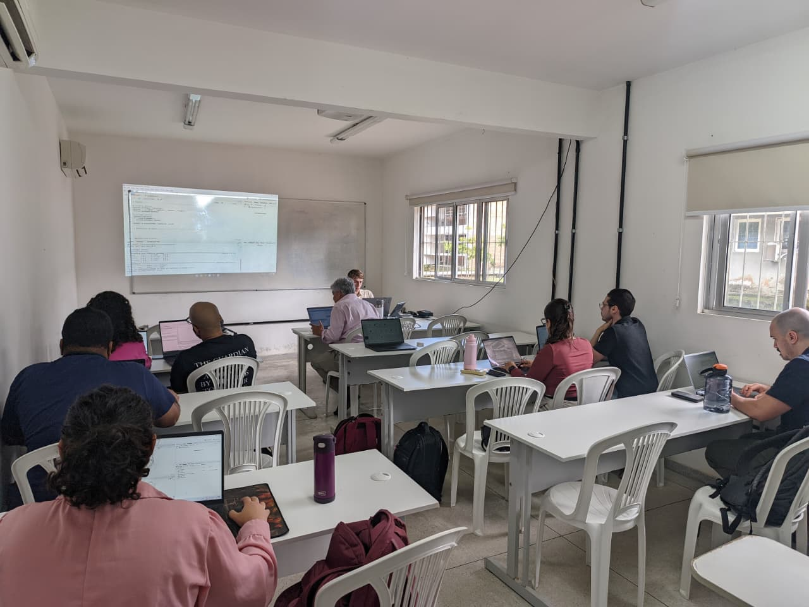
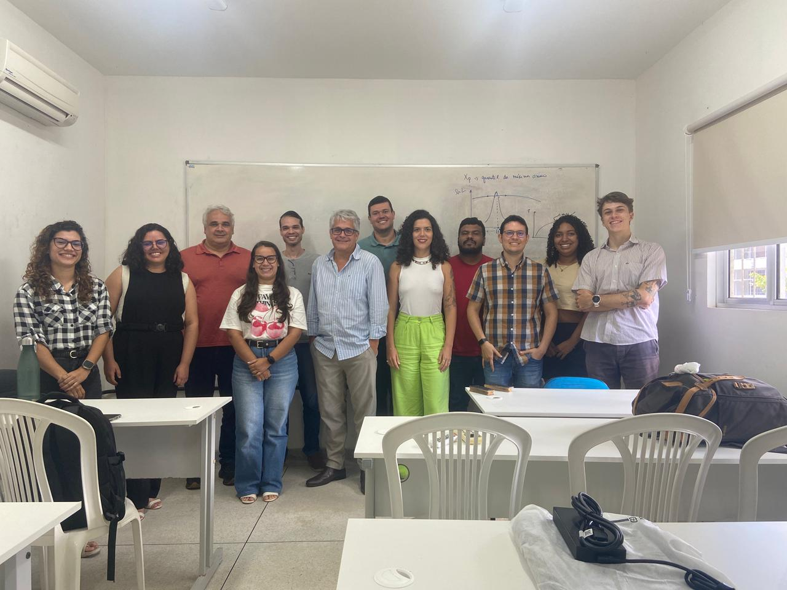
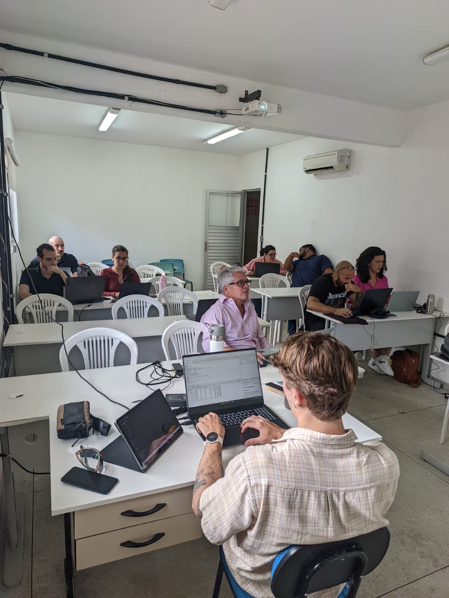
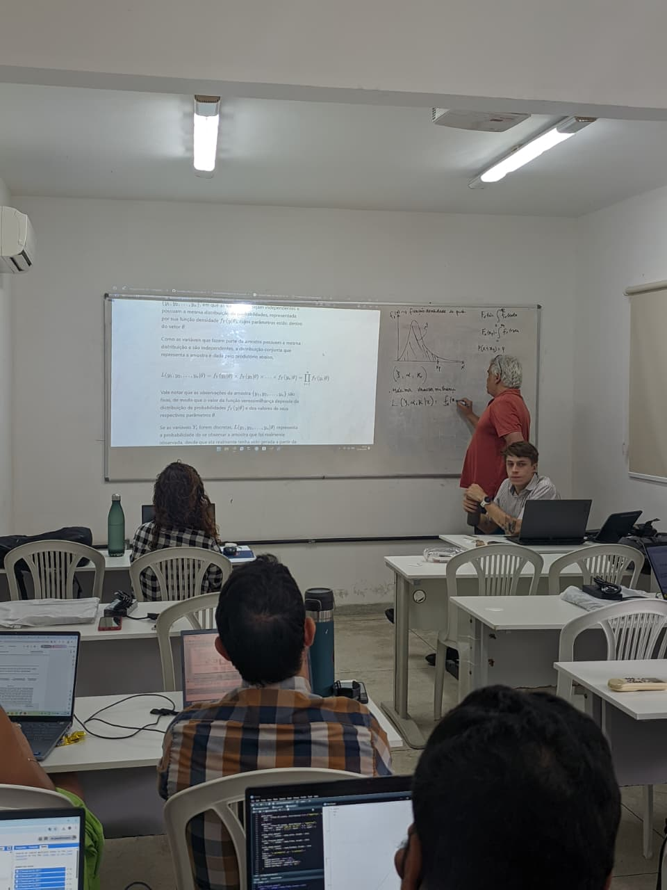

Last week I had the chance to spend one and a half days in the beautiful city of João Pessoa/Paraíba, on a trip related to a project that aims at updating IDF curves for Brazil and estimating possible changes in the future due to climate change. Professor Cristiano Almeida and his team from the Federal University of Paraíba (UFPB) have collaborated with the project by carrying out a quality analysis of sub-daily precipitation data in Brazil and developing a new database with information from various institutions in the country. The details of this IDF project will be discussed in other posts. Here I just want to share the great time I had there.

As we had to deliver three laptops to the research team at UFPB as part of the project deal, Cristiano made the following proposal to our team: deliver the laptops in person, give a short course on the R language and its use in statistical hydrology, and have a meeting to discuss how to improve the collaboration between the two groups. I thought that would make total sense and agreed to him, but had to take Tomás Duval with me, a MSc stdent of mine, who has been working on the project and has already exchanged ideas, questions and answers with some members of the Cristiano's team. Without Tomás, I am afraid giving the course on R wouldn't be possible due to my tight agenda.

Tomás gave a 6-hour set of lectures in R to students and researchers from UFPB the day before my arrival and continued through the morning of the next day. He prepared a nice set of activities for a 10-hour introductory course in statistical hydrology, with a focus on how to use the R language to carry out statistical analysis in hydrology, more specifically on how to obtain a flood frequency curve using local data and employing maximum likelihood estimators. In the afternoon we had the chance to know more about what their team has been working on regarding the general theme of intense precipitation, and we were able to identify specific topics of possible collaboration.

I would like to thank professor Cristiano and his students and colleagues at UFPB for their hospitality. Tomás and I had a great time.

::: {layout-nrow=2}

:::
